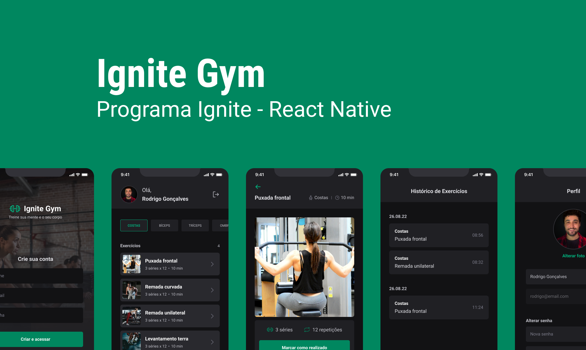
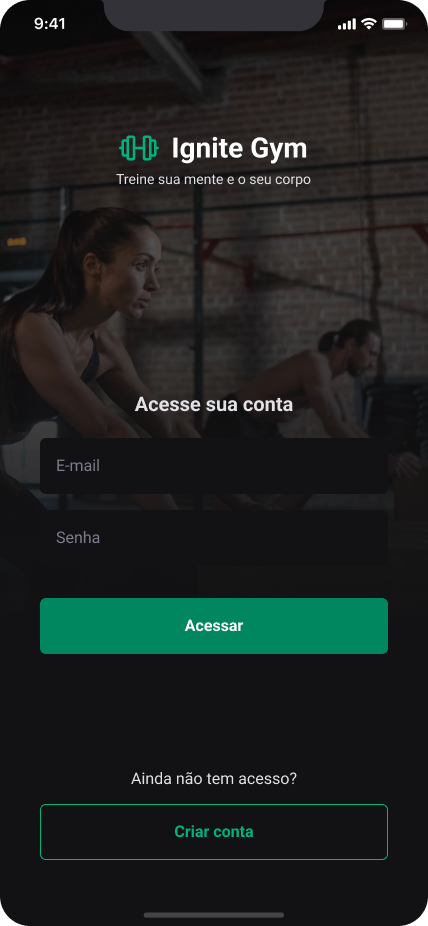
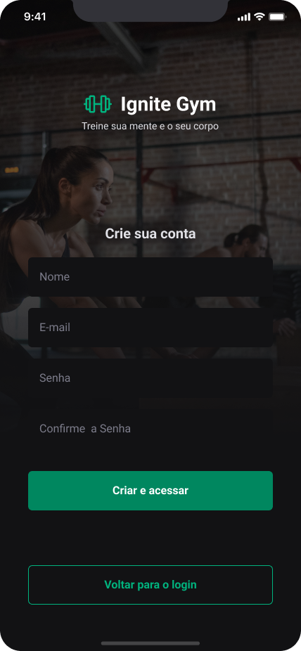
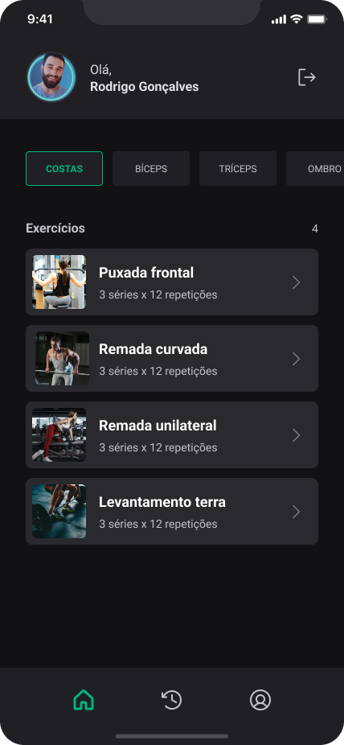
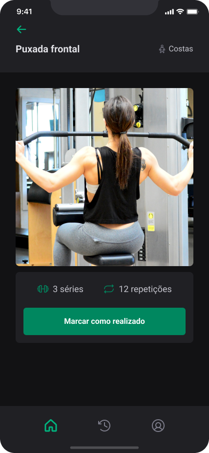
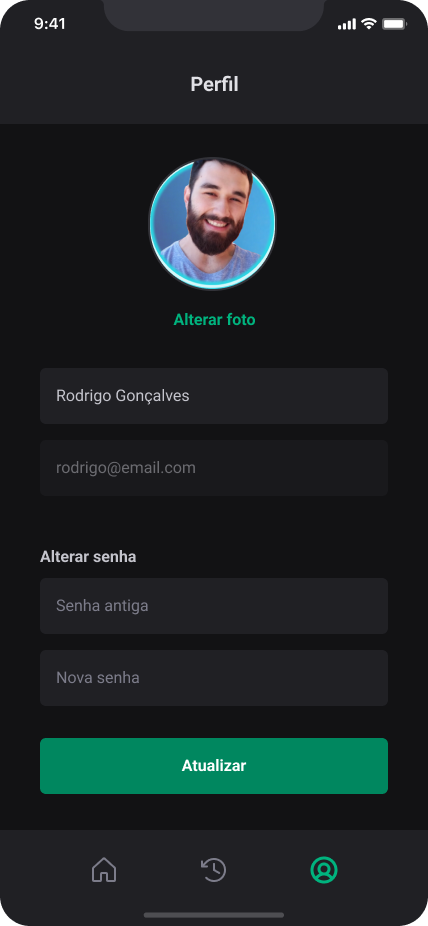

<h1>
  
</h1>

## 💻 Projeto

<h3>
  Projeto criado dentro da trilha de React Native 2022, Ignite Gym é uma aplicação para introdução a utilização do NativeBase, que é um Component Library para construir interfaces com maior produtividade. Uma incrível integração com uma backend construído em Nodejs.
</h3>

----

## ✨ Tecnologia

- **[TypeScript](https://www.typescriptlang.org/)**
- **[React Native](https://reactnative.dev/)**
- **[Expo](https://expo.dev/)**
- **[JWT (Json Web Token)](https://jwt.io/)**
- **[Axios](https://axios-http.com/docs/intro)**
- **[NativeBase](https://nativebase.io/)**
- **[AsyncStorage](https://docs.expo.dev/versions/latest/sdk/async-storage/)**
- **[React Navigation](https://reactnavigation.org/)**
- **[React Hook Form](https://react-hook-form.com/)**
- **[Express](https://expressjs.com/)**

---

## 🎨 Layout

O layout da aplicação está disponível no Figma:

    

  

  

 

    

  

  

---

## 🚀 Como executar o projeto

Em todos os projetos, ao acessar a pasta, é preciso baixar os pacotes com o NPM ou YARN.

Acesse a documentação de cada projeto:

- [Backend](./api/README.md)
- [Mobile](./mobile/README.md)

---
